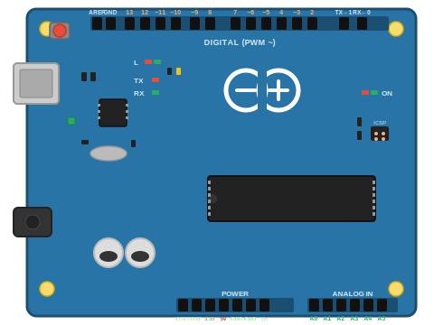
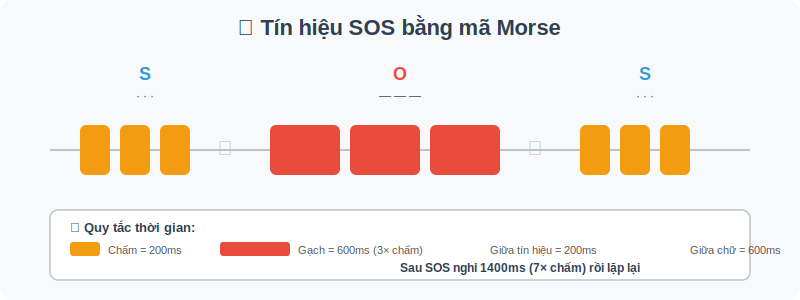

# Đèn SOS cứu hộ

**Số buổi:** 1 x 90 phút

---

## 1. Giới thiệu dự án

### Bối cảnh thực tế

Hãy tưởng tượng bạn đang đi cắm trại trong rừng và bị lạc khi trời tối. Điện thoại hết pin, không có ai xung quanh. Làm sao để gửi tín hiệu cầu cứu? Từ hơn 100 năm trước, các thuỷ thủ đã dùng **mã Morse** — một hệ thống mã hoá chữ cái bằng tín hiệu ngắn (chấm) và dài (gạch). Trong đó, tín hiệu nổi tiếng nhất là **SOS** (Save Our Souls — Cứu lấy chúng tôi):

- **S** = 3 tín hiệu ngắn: `· · ·`
- **O** = 3 tín hiệu dài: `— — —`
- **S** = 3 tín hiệu ngắn: `· · ·`

Hôm nay, các bạn sẽ dùng Arduino và LED để tạo một thiết bị phát tín hiệu SOS tự động!

### Câu hỏi dẫn dắt

"Làm sao để gửi tín hiệu cầu cứu bằng ánh sáng?"

### Mục tiêu học tập

Sau buổi học, bạn có thể:
- [ ] Nhận biết và gọi tên các thành phần cơ bản của Arduino (board, breadboard, LED, điện trở, dây nối)
- [ ] Kết nối mạch LED trên breadboard theo sơ đồ cho trước
- [ ] Viết chương trình điều khiển LED phát tín hiệu SOS theo mã Morse bằng `digitalWrite()` và `delay()`

### Sản phẩm đầu ra

LED phát tín hiệu SOS theo mã Morse (ngắn-ngắn-ngắn / dài-dài-dài / ngắn-ngắn-ngắn), lặp liên tục.

---

## 2. Kiến thức nền tảng

### 2.1 Arduino là gì?



**Arduino Uno** là một bo mạch vi điều khiển — nói đơn giản, nó là một "bộ não nhỏ" có thể được lập trình để điều khiển các thiết bị điện tử.

Các thành phần chính trên board Arduino Uno:
- **Cổng USB:** Kết nối với máy tính để nạp chương trình và cấp nguồn
- **Chân digital (0-13):** Dùng để gửi/nhận tín hiệu bật/tắt (HIGH/LOW)
- **Chân analog (A0-A5):** Dùng để đọc tín hiệu liên tục (sẽ học ở các dự án sau)
- **Chân GND:** Chân nối đất (cực âm)
- **Chân 5V / 3.3V:** Chân cấp nguồn
- **LED L (chân 13):** LED nhỏ có sẵn trên board, nối với chân 13

> 💡 **Mẹo:** Chân số 13 trên Arduino có sẵn 1 LED nhỏ trên board. Bạn có thể dùng nó để test code mà không cần nối mạch ngoài!

### 2.2 Breadboard — bảng cắm mạch

**Breadboard** là bảng nhựa có nhiều lỗ cắm, dùng để kết nối linh kiện mà không cần hàn.

Cách hoạt động:
- Các lỗ trên **cùng 1 hàng ngang** (ở khu vực giữa) được nối thông với nhau
- 2 đường dài ở 2 bên (thường đánh dấu **+** đỏ và **-** xanh) là đường nguồn, nối thông theo chiều dọc

### 2.3 LED và điện trở

**LED** (Light Emitting Diode — Đi-ốt phát quang) là linh kiện phát sáng khi có dòng điện chạy qua.

Đặc điểm quan trọng:
- LED có **2 chân**: chân dài = cực dương (anode, nối với nguồn +), chân ngắn = cực âm (cathode, nối với GND)
- Nếu cắm ngược, LED sẽ không sáng (nhưng không hỏng)

**Điện trở** dùng để hạn chế dòng điện, bảo vệ LED không bị cháy. Trong dự án này, ta dùng điện trở **220Ω**.

> ⚠️ **Lưu ý an toàn:** Luôn dùng điện trở khi nối LED. Nếu nối LED trực tiếp vào nguồn 5V mà không có điện trở, LED có thể cháy!

### 2.4 Mã Morse

**Mã Morse** là hệ thống mã hoá ký tự bằng 2 loại tín hiệu:
- **Chấm (dot):** tín hiệu ngắn
- **Gạch (dash):** tín hiệu dài (gấp 3 lần chấm)



Quy tắc thời gian trong mã Morse:
- 1 chấm = 1 đơn vị thời gian (200ms)
- 1 gạch = 3 đơn vị thời gian (600ms)
- Khoảng cách giữa các tín hiệu trong 1 chữ = 1 đơn vị (200ms)
- Khoảng cách giữa các chữ = 3 đơn vị (600ms)
- Khoảng cách giữa các từ = 7 đơn vị (1400ms)

### 2.5 Cấu trúc chương trình Arduino

Mọi chương trình Arduino đều có 2 hàm chính:

```cpp
void setup() {
  // Chạy 1 lần duy nhất khi Arduino khởi động
  // Dùng để cài đặt ban đầu (ví dụ: khai báo chân)
}

void loop() {
  // Chạy lặp lại liên tục sau khi setup() hoàn thành
  // Đây là nơi đặt code chính của chương trình
}
```

Các hàm quan trọng trong dự án này:
- `pinMode(pin, OUTPUT)` — Khai báo chân `pin` là ngõ ra (để điều khiển LED)
- `digitalWrite(pin, HIGH)` — Bật chân `pin` lên mức cao (LED sáng)
- `digitalWrite(pin, LOW)` — Tắt chân `pin` xuống mức thấp (LED tắt)
- `delay(ms)` — Dừng chương trình trong `ms` mili-giây (1000ms = 1 giây)

---

## 3. Hướng dẫn thực hành

### 3.1 Vật tư và công cụ cần chuẩn bị

| STT | Vật tư / Công cụ | Số lượng | Ghi chú |
|-----|-------------------|----------|---------|
| 1 | Arduino Uno + cáp USB | 1 | Kết nối với máy tính |
| 2 | Breadboard | 1 | |
| 3 | LED (màu bất kỳ) | 1 | Chân dài = +, chân ngắn = - |
| 4 | Điện trở 220Ω | 1 | Vạch màu: đỏ-đỏ-nâu |
| 5 | Dây nối (jumper wire) | 2 | Đực-đực |

### 3.2 Sơ đồ kết nối


Các bước nối:
1. Cắm LED vào breadboard (2 chân ở 2 hàng khác nhau)
2. Nối 1 đầu điện trở vào cùng hàng với chân dài LED (+), đầu còn lại vào hàng khác
3. Dùng dây nối đỏ: từ chân 13 Arduino → đầu còn lại của điện trở
4. Dùng dây nối đen: từ chân GND Arduino → cùng hàng với chân ngắn LED (-)

### 3.3 Hướng dẫn từng bước

**Bước 1: Mở Arduino IDE và tạo chương trình mới**
- Mở Arduino IDE trên máy tính
- Kết nối Arduino qua cáp USB
- Vào Tools → Board → chọn "Arduino Uno"
- Vào Tools → Port → chọn cổng COM tương ứng

**Bước 2: Viết code bật/tắt LED cơ bản (test mạch)**

```cpp
// Test LED - bật tắt đơn giản
int ledPin = 13;  // LED nối vào chân 13

void setup() {
  pinMode(ledPin, OUTPUT);  // Khai báo chân 13 là ngõ ra
}

void loop() {
  digitalWrite(ledPin, HIGH);  // Bật LED
  delay(1000);                 // Đợi 1 giây
  digitalWrite(ledPin, LOW);   // Tắt LED
  delay(1000);                 // Đợi 1 giây
}
```

- Nhấn nút Upload (mũi tên →) để nạp code vào Arduino
- Kết quả mong đợi: LED nhấp nháy đều đặn, 1 giây sáng — 1 giây tắt

> 💡 **Mẹo:** Nếu LED không sáng, kiểm tra: (1) LED có cắm đúng chiều không? (2) Dây nối có chắc không? (3) Đã chọn đúng Board và Port chưa?

**Bước 3: Viết code phát tín hiệu SOS**

```cpp
// Đèn SOS cứu hộ - Mã Morse
int ledPin = 13;      // LED nối vào chân 13
int dotTime = 200;    // Thời gian 1 chấm (ms)
int dashTime = 600;   // Thời gian 1 gạch (= 3 x chấm)
int gapTime = 200;    // Khoảng cách giữa các tín hiệu trong 1 chữ
int letterGap = 600;  // Khoảng cách giữa các chữ (= 3 x chấm)
int wordGap = 1400;   // Khoảng cách giữa các từ (= 7 x chấm)

void setup() {
  pinMode(ledPin, OUTPUT);
}

void loop() {
  // --- Chữ S: 3 chấm ---
  digitalWrite(ledPin, HIGH); delay(dotTime);
  digitalWrite(ledPin, LOW);  delay(gapTime);
  digitalWrite(ledPin, HIGH); delay(dotTime);
  digitalWrite(ledPin, LOW);  delay(gapTime);
  digitalWrite(ledPin, HIGH); delay(dotTime);
  digitalWrite(ledPin, LOW);  delay(letterGap);

  // --- Chữ O: 3 gạch ---
  digitalWrite(ledPin, HIGH); delay(dashTime);
  digitalWrite(ledPin, LOW);  delay(gapTime);
  digitalWrite(ledPin, HIGH); delay(dashTime);
  digitalWrite(ledPin, LOW);  delay(gapTime);
  digitalWrite(ledPin, HIGH); delay(dashTime);
  digitalWrite(ledPin, LOW);  delay(letterGap);

  // --- Chữ S: 3 chấm ---
  digitalWrite(ledPin, HIGH); delay(dotTime);
  digitalWrite(ledPin, LOW);  delay(gapTime);
  digitalWrite(ledPin, HIGH); delay(dotTime);
  digitalWrite(ledPin, LOW);  delay(gapTime);
  digitalWrite(ledPin, HIGH); delay(dotTime);
  digitalWrite(ledPin, LOW);  delay(wordGap);
}
```

- Kết quả mong đợi: LED phát tín hiệu `· · · — — — · · ·` rồi nghỉ, rồi lặp lại

**Bước 4: Thử nghiệm và cải tiến**
- Quan sát LED: tín hiệu SOS có rõ ràng không? Phân biệt được chấm và gạch không?
- Thử thay đổi `dotTime` (ví dụ 100ms hoặc 300ms) để xem tốc độ nào dễ đọc nhất
- So sánh kết quả với bạn cùng nhóm

---

## 4. Nâng cao

**Nâng cao 1: Mã hoá tên mình bằng Morse**

Bảng mã Morse cơ bản:

| Chữ | Morse | Chữ | Morse |
|-----|-------|-----|-------|
| A | `· —` | N | `— ·` |
| B | `— · · ·` | O | `— — —` |
| C | `— · — ·` | P | `· — — ·` |
| D | `— · ·` | Q | `— — · —` |
| E | `·` | R | `· — ·` |
| F | `· · — ·` | S | `· · ·` |
| G | `— — ·` | T | `—` |
| H | `· · · ·` | U | `· · —` |
| I | `· ·` | V | `· · · —` |
| K | `— · —` | W | `· — —` |
| L | `· — · ·` | X | `— · · —` |
| M | `— —` | Y | `— · — —` |

Gợi ý: Sau khi phát SOS, thêm code phát tên mình (ví dụ: "AN" = `· — / — ·`)

**Nâng cao 2: Thêm buzzer phát âm thanh**

Nối thêm buzzer vào chân 12. Thêm `tone(12, 1000)` khi LED sáng và `noTone(12)` khi LED tắt → tín hiệu SOS vừa có ánh sáng vừa có âm thanh.

---

## 5. Câu hỏi ôn tập

1. Arduino Uno có bao nhiêu chân digital? Chân nào có LED sẵn trên board?
2. Tại sao phải dùng điện trở khi nối LED? Nếu không dùng thì sao?
3. Hàm `delay(500)` sẽ làm chương trình dừng bao lâu?
4. Trong mã Morse, làm sao phân biệt chấm và gạch? Tỉ lệ thời gian giữa chúng là bao nhiêu?
5. Nếu muốn tín hiệu SOS nhanh hơn, bạn cần thay đổi giá trị nào trong code?

---

## 6. Thuật ngữ

| Thuật ngữ | Giải thích |
|-----------|------------|
| Arduino Uno | Bo mạch vi điều khiển có thể lập trình để điều khiển thiết bị điện tử |
| Breadboard | Bảng cắm mạch dùng để kết nối linh kiện mà không cần hàn |
| LED | Light Emitting Diode — đi-ốt phát quang, phát sáng khi có dòng điện |
| Điện trở | Linh kiện hạn chế dòng điện, bảo vệ các linh kiện khác |
| `setup()` | Hàm chạy 1 lần khi Arduino khởi động, dùng để cài đặt ban đầu |
| `loop()` | Hàm chạy lặp lại liên tục, chứa code chính của chương trình |
| `digitalWrite()` | Hàm bật (HIGH) hoặc tắt (LOW) một chân digital |
| `delay()` | Hàm dừng chương trình trong một khoảng thời gian (tính bằng ms) |
| `pinMode()` | Hàm khai báo chân là ngõ ra (OUTPUT) hoặc ngõ vào (INPUT) |
| Mã Morse | Hệ thống mã hoá ký tự bằng tín hiệu ngắn (chấm) và dài (gạch) |
| SOS | Tín hiệu cầu cứu quốc tế: `· · · — — — · · ·` |
