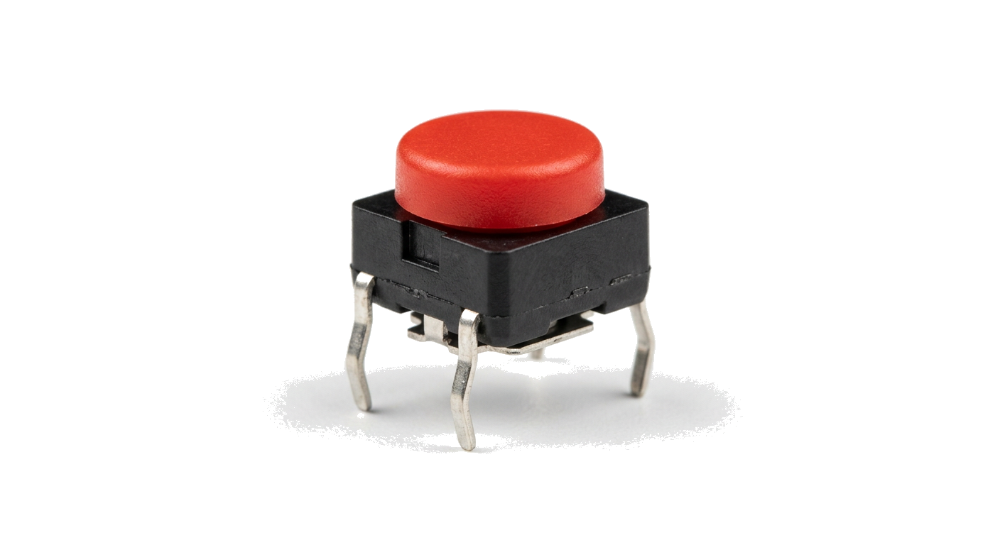
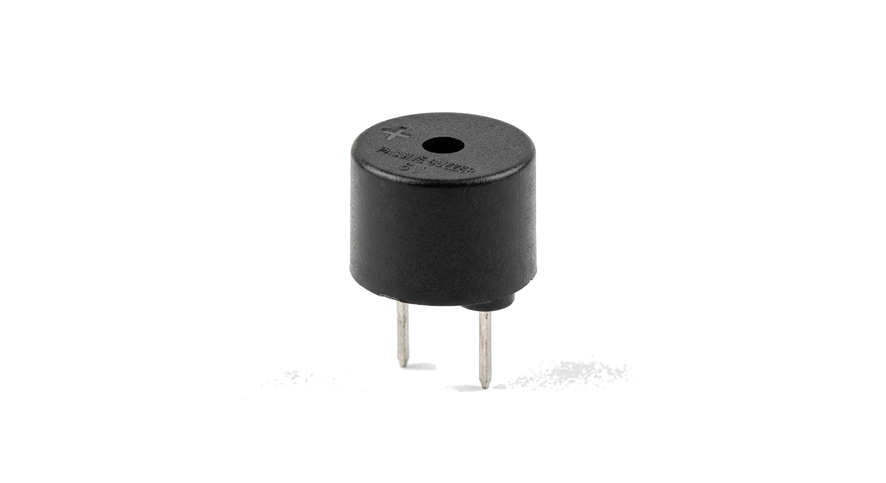

# Chuông cửa thông minh

**Số buổi:** 1 x 90 phút

---

## 1. Giới thiệu dự án

### Bối cảnh thực tế

Bạn đã bao giờ bấm chuông cửa nhà ai chưa? Chuông cửa đơn giản nhất chỉ phát 1 tiếng "ding dong". Nhưng chuông cửa thông minh có thể phát nhiều giai điệu khác nhau — thậm chí bạn có thể tự sáng tác nhạc chuông riêng! Hôm nay, các bạn sẽ tạo một chuông cửa phát nhạc bằng Arduino, nút bấm và buzzer.

### Câu hỏi dẫn dắt

"Làm sao để tạo chuông cửa phát nhạc khi có khách bấm?"

### Mục tiêu học tập

Sau buổi học, bạn có thể:
- [ ] Kết nối nút bấm làm input digital và đọc trạng thái bằng `digitalRead()`
- [ ] Điều khiển buzzer phát giai điệu bằng `tone()` và `noTone()`
- [ ] Áp dụng `if/else` để ra quyết định: khi nút được nhấn → phát chuông, khi thả → tắt
- [ ] Sử dụng biến trạng thái để đếm số lần nhấn và chuyển đổi giai điệu

### Sản phẩm đầu ra

Chuông cửa — nhấn nút → buzzer phát giai điệu. Nhấn nhiều lần → chuyển sang giai điệu khác.

---

## 2. Kiến thức nền tảng

### 2.1 Nút bấm (Push Button)



**Nút bấm** là linh kiện input đơn giản nhất — khi nhấn thì mạch nối thông, khi thả thì mạch hở.

Nút bấm thường có 4 chân, nhưng thực tế chỉ có 2 cặp:
- 2 chân bên trái nối thông với nhau
- 2 chân bên phải nối thông với nhau
- Khi nhấn nút → trái và phải nối thông

Trong dự án này, ta dùng chế độ **INPUT_PULLUP** của Arduino:
- Nối 1 chân nút vào chân digital Arduino, chân còn lại vào GND
- Không cần điện trở ngoài — Arduino có điện trở kéo lên bên trong
- Khi **không nhấn**: `digitalRead()` trả về `HIGH` (1)
- Khi **nhấn**: `digitalRead()` trả về `LOW` (0)

> 💡 **Mẹo:** Với `INPUT_PULLUP`, logic bị đảo — nhấn nút = LOW, thả nút = HIGH. Nhớ điều này khi viết `if/else`!

### 2.2 Buzzer thụ động (Passive Buzzer)



**Buzzer thụ động** là linh kiện phát âm thanh — khác với buzzer chủ động (chỉ kêu 1 tần số), buzzer thụ động có thể phát nhiều tần số khác nhau → tạo được giai điệu.

- **Chân +** (thường có dấu + hoặc chân dài hơn) → nối vào chân digital Arduino
- **Chân -** → nối vào GND

Điều khiển bằng:
- `tone(pin, frequency)` — phát âm thanh ở tần số `frequency` Hz
- `tone(pin, frequency, duration)` — phát trong `duration` ms rồi tự tắt
- `noTone(pin)` — tắt âm thanh

Một số tần số nốt nhạc:

| Nốt | Tần số (Hz) |
|-----|-------------|
| Đô (C4) | 262 |
| Rê (D4) | 294 |
| Mi (E4) | 330 |
| Fa (F4) | 349 |
| Sol (G4) | 392 |
| La (A4) | 440 |
| Si (B4) | 494 |
| Đô cao (C5) | 523 |

### 2.3 Câu lệnh if/else

Ở Dự án 1, chương trình chạy tuần tự từ trên xuống. Giờ ta cần Arduino **ra quyết định**: nếu nút được nhấn → phát chuông, nếu không → im lặng.

```cpp
if (điều_kiện) {
  // Thực hiện khi điều kiện ĐÚNG
} else {
  // Thực hiện khi điều kiện SAI
}
```

Ví dụ:
```cpp
int buttonState = digitalRead(2);  // Đọc trạng thái nút

if (buttonState == LOW) {   // LOW = nút đang được nhấn (INPUT_PULLUP)
  tone(8, 440);             // Phát âm La (440Hz)
} else {
  noTone(8);                // Tắt âm thanh
}
```

### 2.4 Biến trạng thái

**Biến trạng thái** dùng để "nhớ" thông tin giữa các lần lặp của `loop()`. Ví dụ: đếm số lần nhấn nút để chuyển giai điệu.

```cpp
int pressCount = 0;  // Biến đếm số lần nhấn

void loop() {
  if (buttonState == LOW) {
    pressCount = pressCount + 1;  // Tăng đếm mỗi lần nhấn
  }
}
```

> ⚠️ **Lưu ý:** Nút bấm có hiện tượng **bouncing** — khi nhấn 1 lần, tín hiệu có thể nhảy HIGH/LOW nhiều lần trong vài ms. Cần thêm `delay(200)` sau khi phát hiện nhấn để tránh đếm sai.

---

## 3. Hướng dẫn thực hành

### 3.1 Vật tư và công cụ cần chuẩn bị

| STT | Vật tư / Công cụ | Số lượng | Ghi chú |
|-----|-------------------|----------|---------|
| 1 | Arduino Uno + cáp USB | 1 | Từ dự án 1 |
| 2 | Breadboard | 1 | Từ dự án 1 |
| 3 | Nút bấm (push button) | 1 | 4 chân |
| 4 | Buzzer thụ động | 1 | Có dấu + trên mặt |
| 5 | Dây nối (jumper wire) | 4 | Đực-đực |

### 3.2 Sơ đồ kết nối


Các bước nối:
1. **Nút bấm:** 1 chân → chân 2 Arduino, chân đối diện → GND
2. **Buzzer:** chân + → chân 8 Arduino, chân - → GND

### 3.3 Hướng dẫn từng bước

**Bước 1: Test nút bấm bằng Serial Monitor**

```cpp
// Test nút bấm - hiển thị trạng thái trên Serial Monitor
int buttonPin = 2;

void setup() {
  pinMode(buttonPin, INPUT_PULLUP);  // Dùng điện trở kéo lên bên trong
  Serial.begin(9600);                // Bật Serial Monitor
}

void loop() {
  int state = digitalRead(buttonPin);
  if (state == LOW) {
    Serial.println("NUT DANG DUOC NHAN!");
  } else {
    Serial.println("Khong nhan");
  }
  delay(200);
}
```

- Upload code, mở Serial Monitor (Tools → Serial Monitor)
- Kết quả: nhấn nút → hiện "NUT DANG DUOC NHAN!", thả → hiện "Khong nhan"

**Bước 2: Phát 1 nốt nhạc khi nhấn nút**

```cpp
// Chuông cửa đơn giản - 1 nốt
int buttonPin = 2;
int buzzerPin = 8;

void setup() {
  pinMode(buttonPin, INPUT_PULLUP);
  pinMode(buzzerPin, OUTPUT);
}

void loop() {
  int state = digitalRead(buttonPin);
  if (state == LOW) {       // Nút được nhấn
    tone(buzzerPin, 440);   // Phát nốt La (440Hz)
  } else {
    noTone(buzzerPin);      // Tắt âm
  }
}
```

- Kết quả: nhấn nút → buzzer kêu, thả → tắt

**Bước 3: Phát giai điệu khi nhấn nút**

```cpp
// Chuông cửa phát giai điệu
int buttonPin = 2;
int buzzerPin = 8;

// Giai điệu "Ding Dong" (tần số + thời lượng)
int melody[] = {523, 392, 523, 392};     // Đô-Sol-Đô-Sol
int durations[] = {300, 300, 300, 600};  // ms

void setup() {
  pinMode(buttonPin, INPUT_PULLUP);
  pinMode(buzzerPin, OUTPUT);
}

void loop() {
  int state = digitalRead(buttonPin);

  if (state == LOW) {  // Nút được nhấn
    // Phát giai điệu
    for (int i = 0; i < 4; i++) {
      tone(buzzerPin, melody[i], durations[i]);
      delay(durations[i] + 50);  // Đợi nốt phát xong + khoảng nghỉ
    }
    noTone(buzzerPin);
    delay(500);  // Chống bouncing + đợi trước khi phát lại
  }
}
```

- Kết quả: nhấn nút → buzzer phát "Ding Dong Ding Doooong"

**Bước 4: Chuyển đổi giai điệu bằng biến trạng thái**

```cpp
// Chuông cửa thông minh - 2 giai điệu
int buttonPin = 2;
int buzzerPin = 8;
int pressCount = 0;  // Đếm số lần nhấn

// Giai điệu 1: Ding Dong
int melody1[] = {523, 392, 523, 392};
int dur1[] = {300, 300, 300, 600};

// Giai điệu 2: Twinkle Twinkle
int melody2[] = {262, 262, 392, 392, 440, 440, 392};
int dur2[] = {250, 250, 250, 250, 250, 250, 500};

void playMelody(int notes[], int durs[], int len) {
  for (int i = 0; i < len; i++) {
    tone(buzzerPin, notes[i], durs[i]);
    delay(durs[i] + 50);
  }
  noTone(buzzerPin);
}

void setup() {
  pinMode(buttonPin, INPUT_PULLUP);
  pinMode(buzzerPin, OUTPUT);
}

void loop() {
  int state = digitalRead(buttonPin);

  if (state == LOW) {
    pressCount++;

    if (pressCount % 2 == 1) {
      playMelody(melody1, dur1, 4);   // Lần lẻ: Ding Dong
    } else {
      playMelody(melody2, dur2, 7);   // Lần chẵn: Twinkle
    }

    delay(500);  // Chống bouncing
  }
}
```

- Kết quả: nhấn lần 1 → "Ding Dong", nhấn lần 2 → "Twinkle Twinkle", nhấn lần 3 → "Ding Dong" lại,...

---

## 4. Nâng cao

**Nâng cao 1: Nhấn giữ lâu → giai điệu khác**

Dùng `millis()` để đo thời gian nhấn giữ:
```cpp
unsigned long pressStart = 0;

if (state == LOW && pressStart == 0) {
  pressStart = millis();  // Ghi nhận thời điểm bắt đầu nhấn
}
if (state == HIGH && pressStart > 0) {
  unsigned long holdTime = millis() - pressStart;
  if (holdTime > 1000) {
    // Nhấn giữ > 1 giây → giai điệu đặc biệt
  } else {
    // Nhấn ngắn → giai điệu bình thường
  }
  pressStart = 0;
}
```

**Nâng cao 2: Tự sáng tác giai điệu**

Thay đổi mảng `melody[]` và `durations[]` để tạo giai điệu riêng. Tham khảo bảng tần số nốt nhạc ở phần 2.2.

---

## 5. Câu hỏi ôn tập

1. Khi dùng `INPUT_PULLUP`, `digitalRead()` trả về giá trị gì khi nút được nhấn? Khi thả?
2. Sự khác biệt giữa `tone()` và `noTone()` là gì?
3. Tại sao cần `delay(500)` sau khi phát hiện nút nhấn? Nếu bỏ thì sao?
4. Biến `pressCount` dùng để làm gì? Tại sao đặt ngoài `loop()` thay vì bên trong?
5. Làm sao để thêm giai điệu thứ 3 vào chương trình?

---

## 6. Thuật ngữ

| Thuật ngữ | Giải thích |
|-----------|------------|
| Push Button | Nút bấm — nhấn thì mạch nối thông, thả thì hở |
| INPUT_PULLUP | Chế độ input có điện trở kéo lên bên trong Arduino |
| `digitalRead()` | Hàm đọc trạng thái chân digital (HIGH hoặc LOW) |
| Buzzer thụ động | Linh kiện phát âm thanh, có thể phát nhiều tần số khác nhau |
| `tone()` | Hàm phát âm thanh ở tần số chỉ định |
| `noTone()` | Hàm tắt âm thanh |
| `if/else` | Câu lệnh điều kiện — thực hiện code khác nhau tuỳ điều kiện |
| Biến trạng thái | Biến lưu thông tin giữa các lần lặp của `loop()` |
| Bouncing | Hiện tượng tín hiệu nhảy nhiều lần khi nhấn/thả nút bấm |
| Tần số (Hz) | Số dao động mỗi giây — tần số cao = âm thanh cao |
